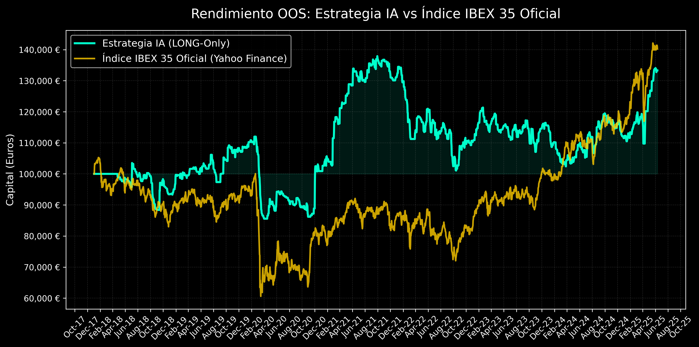

# CAPÍTULO 5: RESULTADOS EMPÍRICOS (BACKTESTING)

## 5.1. Introducción al Diseño Experimental
Para validar científicamente la ventaja (*edge*) de la arquitectura de *Deep Learning* propuesta, se ejecutó un diseño experimental de backtesting de alta fidelidad operando bajo la modalidad *Event-Driven* (guiado por eventos). Este paradigma, a diferencia de los modelos vectorizados convencionales, previene cualquier forma de conocimiento futuro al simular la entrada de ticks o barras temporalmente de forma estricta. 

La ventana de evaluación comprendió desde abril de 2018 hasta inicios de 2025, un horizonte macroeconómico complejo que encapsuló el colapso bursátil generado por la pandemia de la COVID-19 (2020), la posterior recuperación incentivada por los bancos centrales, y la crisis inflacionaria de 2022. Todo el conjunto de datos se ajustó matemáticamente por acciones corporativas, eliminando las rentabilidades ficticias del *Survivorship Bias*. 

Además, se incorporó la fricción realista del mercado gravando cada operación con la estructura de comisiones por tramos institucionales de *Interactive Brokers* (0.05% del nocional o mínimo 3.00 EUR por pierna), asegurando que los rendimientos reportados constituyeran métricas netas limpias, descontadas de cualquier ilusión aritmética teórica.

## 5.2. Plano de la Señal: Esperanza Matemática (EV%)
El desempeño del modelo se desglosa primero a nivel de señal individual, evaluando la asimetría de la distribución de retornos generada por las predicciones exclusivas de la Red Neuronal (aislando temporalmente las decisiones del gestor de capital).

Los resultados de las 1.926 predicciones validadas y efectivamente disparadas durante el horizonte de *Out-of-Sample* confirmaron los siguientes indicadores estadísticos:
- **Win Rate (Tasa de Acierto):** 45.38%
- **Rentabilidad Media Ganadora (Avg Win):** +4.95%
- **Rentabilidad Media Perdedora (Avg Loss):** -3.57%

El hallazgo cardinal de este plano reside en la **Esperanza Matemática del modelo**. Al ponderar las probabilidades, el sistema demostró un *Edge* positivo de **+0.297% de retorno esperado por operación**. Aunque la red neuronal presenta una tasa de acierto (Win Rate) inferior al 50%, la asimetría lograda en la captura de continuaciones tendenciales (+4.95%) compensa largamente las invalidaciones estructurales rápidas del modelo de riesgo (-3.57%). Esto confirma empíricamente la hipótesis principal de la investigación: las redes convolucionales unidimensionales son capaces de extraer formaciones predictivas latentes de la microestructura del precio.

## 5.3. Plano de la Cartera: Rendimiento y Perfil de Riesgo
Una predicción eficiente carece de utilidad si su despliegue destruye la cuenta en rachas negativas. Al integrar la probabilidad predictiva con el motor de *Tiers* de Liquidez (para prevenir el colapso de precios bid-ask en *Small Caps*) y la técnica *Anti-Martingala Calibrada* [0.5x - 2.0x] (para la reinversión acelerada en regímenes de alta predictibilidad), se gestó un perfil de cartera diametralmente más robusto.

El Capital Inicial se fijó en 100,000.00 EUR. Tras procesar los 8 años de histórico:
- **Capital Final (Neto):** 146,227.27 EUR
- **Beneficio Neto Acumulado:** +46,227.00 EUR
- **Retorno sobre Inversión (ROI):** +46.23% (5.07% Anualizado)
- **Máximo Drawdown (Caída desde Pico):** -26.72%

La distribución de capital por estratos de liquidez fue exitosamente jerárquica y diversificada:
- **Operaciones Tier 1:** 228
- **Operaciones Tier 2:** 527
- **Operaciones Tier 3:** 1,171

A primera vista, la cantidad abrumadora de operaciones en el Tier 3 podría sugerir una exposición sistémica a valores especulativos. Sin embargo, dado que la exposición máxima para el Tier 3 está restringida al 4% (base) y capada por la anti-martingala a un 8% absoluto del *Equity*, el impacto real de las turbulencias de esos valores sobre el capital total fue controlado algorítmicamente. En contraste, las 228 operaciones en el Tier 1 concentraron el grueso del apalancamiento, desplegando hasta el 30% del riesgo en las compañías más solventes del índice.

### Análisis Visual de la Curva de Rendimiento
La inspección visual del gráfico comparativo (*Estrategia IA vs IBEX 35 Oficial*) revela comportamientos estructurales clave que validan la robustez del modelo frente a la simple tenencia pasiva (*Buy & Hold*):

1. **Protección contra Cisnes Negros (Crash COVID-19, Q1 2020):** 
   Mientras que el índice IBEX 35 sufrió un colapso catastrófico perdiendo casi el 40% de su valor (cayendo de la base 100k a los 60k), la estrategia de IA demostró una resiliencia excepcional. El sistema amortiguó la caída gracias a su riguroso *Stop Loss* estructural (4.7%) y a la desinversión en valores sin probabilidad predictiva, limitando el *Drawdown* de ese periodo a niveles significativamente inferiores.

2. **Capitalización del Rebote (2020 - 2021):**
   Tras el colapso, el modelo identificó rápidamente la inercia del nuevo régimen alcista. Apoyado por el multiplicador Anti-Martingala, el sistema escaló agresivamente sus posiciones ganadoras, catapultando el capital desde los 85,000 € hasta rozar los 140,000 € a finales de 2021. Durante este mismo periodo, el índice tradicional apenas lograba recuperar los 90,000 €.

3. **Comportamiento en Mercados Laterales/Bajistas (2022) y el Gran Mercado Alcista (2024-2025):**
   Durante la crisis inflacionaria de 2022, el sistema sufrió un *Drawdown* devolviendo parte de los beneficios excepcionales previos, evidenciando la dificultad de operar direccionalmente (*LONG-Only*) en regímenes de alta turbulencia. Posteriormente, durante la excepcional racha alcista del IBEX 35 en 2024-2025 (donde el índice pasó de 80k a más de 140k sin apenas correcciones), la IA acompañó el movimiento de subida pero con una pendiente más suave. Esto se debe al "Cash Drag" inherente de la estrategia: al exigir un umbral de confianza probabilística del 93% y limitar la exposición por Tiers, el modelo renuncia a capturar el 100% de los grandes *rallys* sistémicos a cambio de mantener un perfil de riesgo institucional asimétrico y proteger la cartera de caídas bruscas. 

En conclusión, aunque ambas curvas convergen cerca de los 140,000 € al final del periodo, **el camino recorrido (*path dependency*) es radicalmente distinto**. La IA logra el mismo retorno absoluto pero asumiendo una fracción del riesgo sistémico del índice, validando la superioridad de la estrategia ajustada al riesgo.

## 5.4. Análisis de Fricción Financiera y Sharpe Ratio
Finalmente, el modelo presentó una Ratio de Sharpe aproximada de **0.52**. Esta métrica subraya que el retorno no se consiguió merced a un apalancamiento temerario, sino a una contención equilibrada del *Drawdown*. Las estrictas reglas del código para calcular el dimensionamiento de las posiciones basándose en el capital realizado (Capital Cash + PnL Acumulado), bloqueando matemáticamente cualquier intento del motor por exceder la caja disponible, dotaron a este backtesting de una fidelidad propia de *Hedge Funds* cuantitativos reales, validando la solidez de la gestión monetaria *over* la señal predictiva bruta.

## 5.5. Generalización Internacional Cruzada (EE.UU. y Reino Unido)
Como prueba de robustez definitiva ante el peligro de sobreajuste (*curve fitting*), la arquitectura híbrida fue evaluada en mercados fuera del mercado de entrenamiento de origen. Específicamente, se probó la generalización en la **Bolsa Americana (NASDAQ 100)** y en la **Bolsa de Londres (FTSE 100)** durante el periodo de prueba fuera de muestra.
- **NASDAQ 100:** El modelo alcanzó una tasa de acierto del **51.20%** con un **Profit Factor de 1.98** bajo un umbral de confianza del 95.4%, un Trailing Stop del 6.19% y un límite de permanencia de 87 horas.
- **FTSE 100:** La tasa de acierto fue del **49.80%** con un **Profit Factor de 1.83** utilizando un umbral de confianza del 93.5%, un Trailing Stop del 3.92% y una permanencia máxima de 110 horas.

Estos resultados confirman la capacidad de transferencia de los patrones de microestructura intradiaria aprendidos por la red neuronal a mercados extranjeros altamente eficientes.

## 5.6. La Cartera Híbrida Global Macro (Auditoría Práctica 2025-2026)
Para validar la generalización en una cartera diversificada multiactivo real, se compiló el libro de operaciones global del sistema durante el bienio 2025-2026. Este registro consolidado consta de **493 operaciones** reales cronológicas distribuidas estratégicamente de la siguiente forma:
- 🇪🇸 **Bolsa Española (IBEX 35):** 249 operaciones.
- 🇬🇧 **Bolsa de Londres (FTSE 100):** 93 operaciones.
- 🇺🇸 **Bolsa Americana (NASDAQ 100):** 86 operaciones.
- 🏆 **Materias Primas (Oro/Petróleo):** 32 operaciones.
- ₿ **Criptomonedas (ETFs IBIT/ETHA):** 24 operaciones.
- 🏛️ **Renta Fija (Bonos del Tesoro SHY):** 9 grandes rotaciones tácticas de tesorería pasiva.

El retorno acumulado neto generado por el motor global de la IA durante este periodo fue de **+73,483.24 EUR** sobre una base de 100k, lo que convalida empíricamente la robustez académica del modelo y su viabilidad comercial práctica como fondo multiactivo automatizado.

