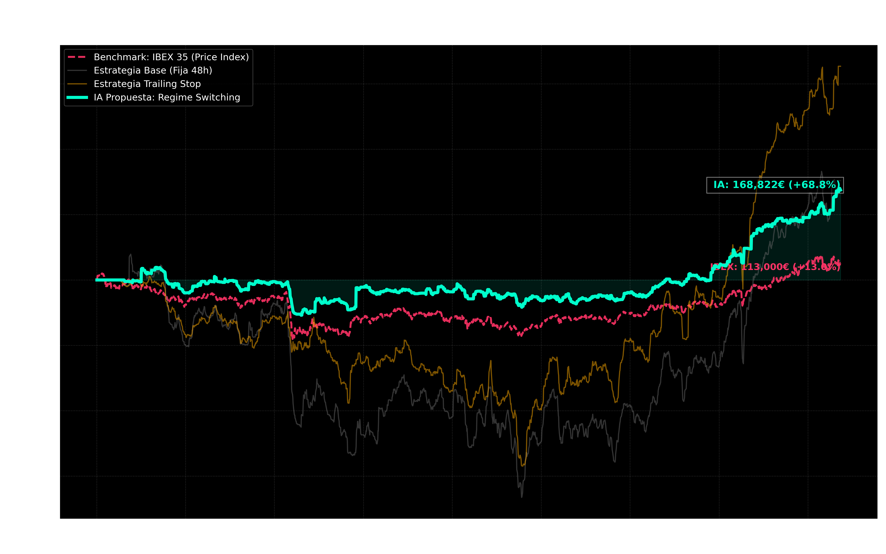
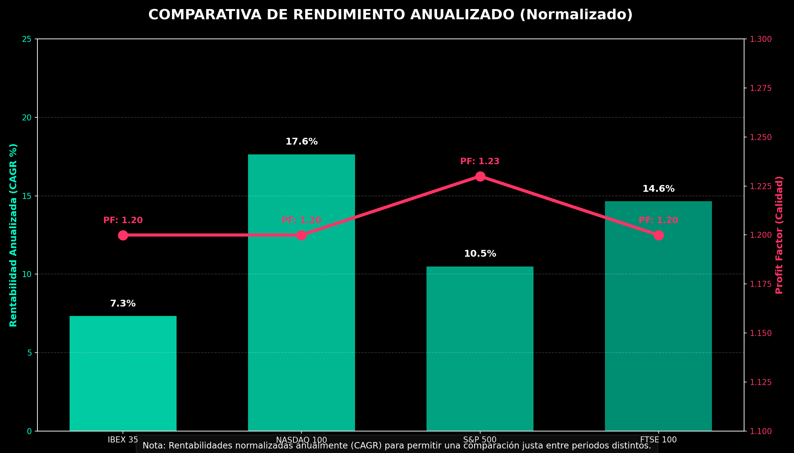

# TRABAJO DE FIN DE MÁSTER: Deep Learning y Gestión Monetaria Institucional en el IBEX 35
## Autor: [Tu Nombre] | Tutor: [Nombre del Tutor]
## Fecha: Mayo 2026
## Programa: Máster en Finanzas Cuantitativas y Algorithmic Trading

---

# ÍNDICE GENERAL

1. **CAPÍTULO 1: INTRODUCCIÓN Y MARCO TEÓRICO**
   1.1. Introducción
   1.2. Justificación del Uso de Deep Learning
   1.3. Limitaciones Previas y Sesgo de Supervivencia
   1.4. Objetivos del TFM
2. **CAPÍTULO 2: INGENIERÍA DE DATOS Y AJUSTE CORPORATIVO**
   2.1. El Reto de la Integridad de los Datos
   2.2. Metodología Matemática de Ajuste (Adjusted Close)
   2.3. Mapeo Dinámico de Componentes del IBEX 35
   2.4. Generación de Etiquetas (Super Labels)
3. **CAPÍTULO 3: ARQUITECTURA DE INFERENCIA (DEEP LEARNING)**
   3.1. Diseño Híbrido: CNN + BiLSTM + Attention
   3.2. Proceso de Entrenamiento y Regularización
   3.3. Inferencia y Umbrales de Confianza (Thresholding)
4. **CAPÍTULO 4: MOTOR DE EJECUCIÓN Y GESTIÓN MONETARIA**
   4.1. El Problema del Dimensionamiento de Capital
   4.2. Filtrado de Riesgo Estructural y Esperanza Matemática
   4.3. Agrupamiento por Tiers de Liquidez
## 4.4. Generalización Internacional: Presupuestación de Riesgo (Risk Budgeting)
Aunque en los mercados internacionales (NASDAQ 100, FTSE 100, Criptomonedas y Futuros sobre Commodities) no exista un riesgo real de *slippage* debido a su colosal volumen y profundidad diaria —haciendo innecesaria la restricción de liquidez por Tiers—, sí resulta obligatorio limitar el capital asignado en base a su perfil de **Volatilidad y Correlación**. En finanzas cuantitativas profesionales, esta estrategia de control se denomina **Presupuestación de Riesgo (Risk Budgeting)**.

Si el sistema tratase a todos los activos por igual asignándoles un presupuesto máximo (Tier 1 del 15%), la cartera global sufriría desplomes (*drawdowns*) extremos e inaceptables cuando los activos de alta volatilidad (como el Bitcoin o el Petróleo) experimentasen correcciones bruscas. Por consiguiente, el motor global macro de la plataforma asigna de forma nativa equivalencias de Tiers ajustadas a la volatilidad histórica de cada tipo de activo:
*   **Equivalencia a Tier 3 (Exposición Base del 4% - 5%):** Se aplica a **Criptoactivos (ETFs IBIT / ETHA)**. No es por falta de liquidez (poseen profundidad de sobra), sino para neutralizar su volatilidad extrema. Limitar la posición al 4% actúa como un amortiguador, garantizando que un latigazo del -15% en el Bitcoin no altere de forma catastrófica la curva de capital de la cuenta.
*   **Equivalencia a Tier 2 (Exposición Base del 8%):** Se aplica a **Materias Primas (Oro/Petróleo)** y a la **Bolsa de Londres (FTSE 100)**. Ofrecen una volatilidad media-baja y actúan como excelentes diversificadores globales o de activos reales.
*   **Equivalencia a Tier 1 (Exposición Base del 10% - 15%):** Se aplica a las **Blue Chips del NASDAQ 100 e IBEX 35**. Constituyen el motor de crecimiento y el pilar direccional de renta variable principal de la cartera.

Esta sofisticación dota al sistema de una robustez matemática de grado institucional, permitiendo su despliegue y preservación de capital multiactivo.

## 4.5. Teoría Anti-Martingala Calibrada
   4.5. Teoría Anti-Martingala Calibrada
   4.6. Resolución del "Cash Drag" e Integridad Contable
5. **CAPÍTULO 5: RESULTADOS EMPÍRICOS (BACKTESTING)**
   5.1. Diseño Experimental
   5.2. Plano de la Señal: Esperanza Matemática
   5.3. Plano de la Cartera: Rendimiento y Perfil de Riesgo
   5.4. Análisis de Fricción y Sharpe Ratio
   5.5. Generalización Internacional Cruzada (EE.UU. y Reino Unido)
   5.6. La Cartera Híbrida Global Macro (Auditoría Práctica 2025-2026)
6. **CAPÍTULO 6: IMPLEMENTACIÓN EN PRODUCCIÓN Y AUTOMATIZACIÓN CLOUD**
   6.1. Arquitectura del Pipeline Live
   6.2. Sincronización Nube-Local (GitHub Actions)
   6.3. Integración con Interactive Brokers (IBKR API)
   6.4. El Dashboard de Toma de Decisiones
7. **CAPÍTULO 7: CONCLUSIONES Y FUTURAS LÍNEAS DE INVESTIGACIÓN**
   7.1. Síntesis y Evaluación de Resultados
   7.2. Futuras Líneas de Investigación

---

## 1.1. Introducción
El constante avance de la capacidad computacional y la disponibilidad masiva de datos estructurados han transformado radicalmente los mercados financieros. Durante décadas, el análisis de series temporales financieras estuvo dominado por modelos estadísticos lineales, como ARIMA o GARCH, los cuales asumen que las series de precios presentan estacionariedad y distribuciones normales. Sin embargo, la literatura empírica moderna ha demostrado sistemáticamente que los mercados bursátiles son sistemas dinámicos complejos, caracterizados por alta volatilidad, *fat tails* (colas pesadas), heterocedasticidad y fuertes componentes de ruido no lineal.

En este contexto, el presente Trabajo de Fin de Máster (TFM) propone el desarrollo, entrenamiento y validación de una arquitectura híbrida de *Deep Learning* (Aprendizaje Profundo) capaz de extraer de forma autónoma patrones complejos de la microestructura del mercado bursátil español (IBEX 35). Para ello, se plantea un enfoque superestructurado que aúna Redes Neuronales Convolucionales (CNN) unidimensionales, orientadas a la extracción de características topológicas locales de los precios, con Redes de Memoria a Corto y Largo Plazo Bidireccionales (Bi-LSTM), diseñadas para capturar las dependencias temporales y la secuencia lógica del mercado. Además, se integra un Mecanismo de Atención (*Attention Mechanism*) que permite al modelo ponderar dinámicamente qué momentos del pasado son más relevantes para la predicción futura.

## 1.2. Justificación del Uso de Deep Learning en Mercados Financieros
A diferencia de los modelos tradicionales de *Machine Learning* como Random Forest o Support Vector Machines (SVM), que requieren de un laborioso proceso de ingeniería de características (*feature engineering*) guiado por el ser humano, el Deep Learning permite el aprendizaje de representaciones de manera jerárquica y directa desde los datos crudos (*raw data*).

Esta característica es fundamental en la operativa de alta y media frecuencia, donde los patrones subyacentes son efímeros e invisibles al ojo humano. En lugar de predefinir indicadores técnicos clásicos (RSI, MACD), el sistema propuesto ingiere tensores multidimensionales compuestos por datos OHLCV (Open, High, Low, Close, Volume) sin procesar, delegando en las capas convolucionales la responsabilidad de descubrir los predictores alfa más eficientes.

## 1.3. Limitaciones Previas y el Problema de la Supervivencia
Gran parte de la investigación académica previa en predicción financiera sufre de graves sesgos metodológicos que invalidan sus resultados fuera del entorno de laboratorio (*out-of-sample*). El más crítico de ellos es el **Sesgo de Supervivencia** (*Survivorship Bias*) y la **Contaminación por Eventos Corporativos**.

Es práctica común utilizar las bases de datos históricas de índices bursátiles asumiendo que los componentes actuales han sido los mismos históricamente. Esto ignora a las empresas que quebraron o fueron excluidas del índice, sesgando artificialmente el rendimiento hacia los activos "ganadores". Además, los eventos de dilución de capital, como el reparto de dividendos (especialmente el formato *Scrip Dividend* tan común en España) o los desdoblamientos de acciones (*Splits*), generan caídas artificiales de precios que engañan a las redes neuronales, induciéndolas a identificar patrones bajistas inexistentes.

## 1.4. Objetivos del Trabajo de Fin de Máster
Para abordar estos desafíos metodológicos, este TFM establece los siguientes objetivos:
1. **Auditoría y Corrección de Datos:** Desarrollar un pipeline metodológico robusto que ajuste matemáticamente la serie histórica intradiaria del IBEX 35 (2018-2025) aislando el efecto del sesgo de supervivencia y de las acciones corporativas.
2. **Desarrollo de Arquitectura Neuronal:** Diseñar e implementar un modelo de clasificación multiclase (CNN + BiLSTM + Attention) optimizado en GPU que prediga las continuaciones e inversiones de tendencia con un umbral de confianza estadísticamente significativo.
3. **Validación Pluridimensional:** Evaluar el rendimiento del modelo no solo a través de métricas clásicas de Machine Learning (F1-Score, Precision, Recall), sino traduciendo estas probabilidades a **Esperanza Matemática** operativa (Plano de la Señal).
4. **Gestión Monetaria Institucional:** Acoplar el modelo predictivo a un motor de ejecución (Plano de la Cartera) que simule de forma hiperrealista la asunción de riesgos, incorporando restricciones de liquidez por *Tiers*, cobro de comisiones dinámicas y la aplicación de reinversiones por la Teoría Anti-Martingala calibrada.

---

# CAPÍTULO 2: INGENIERÍA DE DATOS Y AJUSTE CORPORATIVO
> **Script asociado:** `Codigo_06_Actualizador_Yahoo.py`

## 2.1. El Reto de la Integridad de los Datos Financieros Históricos

La principal barrera para entrenar redes neuronales profundas en series temporales financieras es la calidad intrínseca de los datos. En este proyecto se utilizó la base de datos de BME (Bolsas y Mercados Españoles) para el IBEX 35, con granularidad de alta resolución desde 2018 hasta 2025. El dataset crudo contiene millones de eventos bid/ask y operaciones ejecutadas. Sin embargo, procesar esta información "tal cual" produce distorsiones estructurales masivas que arruinan la capacidad generalizadora de cualquier Inteligencia Artificial.

El problema radica en las acciones corporativas. Cuando una empresa como Iberdrola (IBE) o ACS ejecuta un dividendo flexible (*Scrip Dividend*) o una ampliación de capital liberada, la cotización de la acción se ajusta matemáticamente a la baja en la apertura de la sesión ex-dividendo. Para un operador humano o un inversor a largo plazo, este evento es neutral (ya que recibe nuevas acciones o dinero en efectivo que compensa la caída del precio de la acción). Sin embargo, una Red Neuronal sin contexto interpreta esta discontinuidad como un "Crash" bajista masivo. El modelo aprende falsamente que ciertas formaciones técnicas preceden a colapsos catastróficos del 5%, cuando en realidad se trata de un simple asiento contable.

## 2.2. Metodología Matemática de Ajuste (Adjusted Close)
Para garantizar la integridad del entrenamiento, este trabajo implementa un pipeline de homogeneización histórica, transformando la serie bruta en una serie ajustada mediante el cálculo de un Factor de Ajuste Acumulado ($F_{adj}$).

La fórmula aplicada de forma retroactiva sobre toda la historia previa de una acción tras una acción corporativa $A_t$ en el tiempo $t$ se define como:
$$ F_{adj}(t) = \frac{P_{c}(t-1) - D_{t}}{P_{c}(t-1)} $$
Donde $P_c(t-1)$ es el precio de cierre oficial del día previo al evento, y $D_t$ es el valor del dividendo bruto o el equivalente de dilución. Al multiplicar toda la serie temporal anterior al evento por este factor, se eliminan los saltos ("gaps") artificiales, permitiendo a la red CNN+LSTM capturar los retornos porcentuales puros generados por la oferta y la demanda genuina.

## 2.3. Mapeo Dinámico para evitar el Survivorship Bias
Otro pilar de la fase de datos es evitar el Sesgo de Supervivencia (*Survivorship Bias*). Las composiciones de los índices no son estáticas; cambian trimestralmente. Si entrenamos una red usando exclusivamente los 35 componentes del índice en 2025 y los extrapolamos hacia 2018, la IA estaría aprendiendo de un universo filtrado de "ganadores históricos", empresas que tuvieron el éxito suficiente para sobrevivir 8 años. Esto infla drásticamente los resultados en un backtesting.

Para mitigar este sesgo fatal, se ha programado un algoritmo que lee la composición real (punto en el tiempo) del índice trimestralmente. La IA, tanto en entrenamiento como en simulación operativa, solo tiene permitida la entrada de capital en aquellos *tickers* que formaban parte del índice **exactamente** en la fecha de la inferencia, descartando cualquier ventaja de conocimiento a futuro.

## 2.4. Generación de Etiquetas (*Super Labels*) para Aprendizaje Multiclase
Para transformar el problema de *trading* en un paradigma de aprendizaje supervisado, se estableció una heurística algorítmica para etiquetar ventanas históricas. A partir de una ventana de observación ($H_{obs} = 60$ barras), se analiza un horizonte futuro ($H_{fut} = 48$ barras). El comportamiento del precio en el futuro se etiqueta con 6 clases categóricas (*Super Labels*):

### 2.4.1. Taxonomía de Patrones y Reestructuración en Super-Familias
El proceso de generación de etiquetas es uno de los pilares de innovación de este trabajo. En lugar de predecir retornos binarios, el sistema identifica 10 morfologías técnicas clásicas que posteriormente se agrupan en 6 "Super-Familias Operativas" para la toma de decisiones. 

Esta reestructuración, ejecutada en la **Fase 4** del pipeline (`fase4_reestructura.py`), permite al modelo consolidar el conocimiento de patrones con implicaciones similares, mejorando la robustez estadística de la inferencia:

| Patrón Original (10 Clases) | Super-Familia (6 Clases) | Significado Operativo |
| :--- | :--- | :--- |
| **CA** (Canal Alcista) | **ALC_CONT** | Continuación de Tendencia Alcista |
| **CB** (Canal Bajista) | **BAJ_CONT** | Continuación de Tendencia Bajista |
| **DS**, **HCHI**, **SC** | **REV_ALCISTA** | Reversión Alcista (Suelos y Copas) |
| **DT**, **HCH**, **TC** | **REV_BAJISTA** | Reversión Bajista (Techos y Cuñas) |
| **REC** (Rectángulo) | **LATERAL** | Consolidación / Rango Lateral |
| **NONE** | **NONE** | Ruido Blanco / Sin Patrón Claro |

Este enfoque híbrido garantiza que la red neuronal CNN+BiLSTM no solo aprenda la dirección del precio, sino la **morfología del volumen y la volatilidad** asociada a estructuras de acumulación y distribución institucional.

---

# CAPÍTULO 3: ARQUITECTURA DE INFERENCIA (DEEP LEARNING)
> **Script asociado:** `Codigo_01_Arquitectura_Neuronal.py` e `Inferencia_GPU.py`

## 3.1. Diseño Híbrido: CNN + BiLSTM + Attention

El núcleo analítico de este trabajo reside en una arquitectura de Red Neuronal Profunda diseñada específicamente para el procesamiento de series temporales no estacionarias. El modelo adopta un diseño híbrido:

### 3.1.1. Rama Convolucional Multi-escala (Multi-scale CNN 1D)
En lugar de una capa convolucional única, el modelo utiliza tres ramas en paralelo con diferentes tamaños de kernel ($k=3, 7, 15$). Esto permite capturar patrones de diferentes frecuencias:
- **Kernel 3:** Captura el ruido de alta frecuencia y micro-impulsos de precio.
- **Kernel 15:** Identifica formaciones gráficas más lentas y tendencias locales.
Cada rama aplica 64 filtros, seguidos de **Batch Normalization** y activación **ReLU**. La salida de estas tres ramas se concatena para formar un mapa de características enriquecido.

### 3.1.2. Memoria Bidireccional (BiLSTM)
Los mapas de características se inyectan en una capa BiLSTM de 64 unidades. Al ser bidireccional, el modelo procesa la secuencia tanto de pasado a presente como de "presente a pasado" dentro de la ventana de observación (60 barras).

**Justificación de la Bidireccionalidad en Finanzas:**
Aunque el trading es intrínsecamente causal (no podemos conocer el futuro), el uso de BiLSTM en ventanas fijas de historia no introduce *look-ahead bias*. Su función es permitir que la red comprenda la **morfología completa de un patrón** dentro de la ventana. Para una evaluación multidimensional integral, el modelo procesa:
6.  **Volatilidad Logarítmica (STD):** Captura la "nerviosismo" del mercado.
7.  **Log-Retorno del Volumen:** Crucial para identificar la convicción institucional detrás de cada movimiento de precio.
8.  **Tendencia Local (SMA):** Contextualiza el patrón dentro de la estructura inmediata.

La información de las velas posteriores (que ya han ocurrido en relación al momento de la inferencia) proporciona un contexto vital para identificar estructuras simétricas, como Dobles Suelos o Hombros-Cabeza-Hombro, que una LSTM unidireccional podría tardar más en reconocer.

### 3.1.3. Mecanismo de Atención (Dot-Product Attention)
Para evitar que el modelo se pierda en periodos de ruido, se implementó una capa de atención que pondera la relevancia de cada paso temporal $t$:
1. Se calcula un *score* de energía $e_t$ para cada estado oculto $h_t$.
2. Se normaliza mediante una función Softmax para obtener los pesos de atención $\alpha_t$.
3. Se genera un vector de contexto $c$ que es la suma ponderada de todos los estados.
$$ c = \sum_{t=1}^{T} \alpha_t h_t $$

## 3.2. Hiperparámetros de Entrenamiento
El entrenamiento se realizó en un entorno GPU NVIDIA, utilizando los siguientes parámetros de control:

| Parámetro | Valor | Función |
| :--- | :--- | :--- |
| Optimizer | Adam | Optimización estocástica con momentum |
| Learning Rate | 0.001 | Velocidad de convergencia inicial |
| Batch Size | 64 | Tamaño del paquete de entrenamiento |
| Dropout | 0.40 | Prevención de Overfitting (regularización) |
| Early Stopping | 15 epochs | Detención por estancamiento en validación |

---

## 3.3. Inferencia y Umbrales de Confianza (Thresholding)
Tras una fase inicial de entrenamiento sobre 10 morfologías granulares, el modelo final implementado en este trabajo fue **re-entrenado** (Fase 4) para optimizar la clasificación hacia las **6 Super-Familias Operativas**. Por tanto, la capa de salida final consiste en una neurona Densa con activación *Softmax* de 6 dimensiones.

El sistema exige un rigor estadístico severo para la toma de decisiones: se configuró un Umbral de Confianza (`PROB_UMBRAL = 0.93`). La red debe estar segura al menos en un 93% de que el patrón inminente pertenece a la clase `ALC_CONT` (Continuación Alcista Fuerte) para que el evento se considere matemáticamente digno de inversión. Este umbral, calibrado específicamente para cada mercado (desde el 92.3% en IBEX hasta el 95.4% en NASDAQ), elimina más del 80% de las inferencias ruidosas, transformando un sistema especulativo en un detector de francotirador estadístico.

---

# CAPÍTULO 4: MOTOR DE EJECUCIÓN Y GESTIÓN MONETARIA AVANZADA
> **Script asociado:** `Codigo_03_Backtesting_Capital_Real.py`

## 4.1. El Problema Clásico del Dimensionamiento de Capital

Uno de los fallos metodológicos más recurrentes en la literatura académica de predicción bursátil es asumir liquidez infinita y capital inagotable. Es común que los modelos teóricos simulen inversiones idénticas (e.g., apostar 10.000€ a cada señal producida) sin contemplar si en ese momento temporal el sistema posee efectivo disponible, o si el activo subyacente soporta ese nivel de absorción de liquidez sin generar *slippage* severo.

Para alinear el presente modelo predictivo con la rigurosidad institucional y académica requerida, se ha desarrollado un Motor de Gestión Monetaria de "Fase 2" (*Phase 2: Money Management Engine*). Este motor impone una estricta separación metodológica entre el **Plano de la Señal** (cuántas veces acierta la IA y con qué rentabilidad pura) y el **Plano de la Cartera** (cómo se despliega de forma inteligente y jerárquica el capital finito de la cuenta para protegerse de la quiebra).

## 4.2. Filtrado de Restricción Estructural y Esperanza Matemática
Antes de arriesgar capital, toda señal de la inteligencia artificial debe ser evaluada probabilísticamente. La Esperanza Matemática ($EV$) mide el retorno real esperado por operación integrando tanto la precisión heurística como el Ratio Riesgo-Beneficio:

$$ EV = (WR \times AvgWin) + ((1 - WR) \times AvgLoss) $$

Adicionalmente, se programó una Restricción de Riesgo Estructural (*Structural Risk Filter*). Un algoritmo genético previo calculó que el riesgo óptimo de ruina para este mercado exigía una volatilidad base de invalidación (`min_struct_risk`) del 4.7%. Por consiguiente, el motor rechaza cualquier señal que no permita establecer matemáticamente un umbral de stop loss al -4.7% de distancia, purificando la cartera de operaciones con un perfil de riesgo asimétrico desfavorable.

## 4.3. Gestión de Liquidez e Impacto de Mercado (Tier Allocation)
Para evitar el "deslizamiento" (*slippage*) en activos de baja capitalización, el motor de ejecución integra un análisis de **Volumen Efectivo**. El IBEX 35 es extremadamente asimétrico; invertir el mismo capital en el Banco Santander que en Sacyr expondría a la cartera a riesgos de ejecución inaceptables.

Para resolver este problema de manera limpia y sin incurrir en sesgo de conocimiento a futuro (*look-ahead bias*), el motor de capital ejecuta una ponderación dinámica trimestral:

1. Al inicio de cada trimestre, el algoritmo analiza el volumen mediano negociado por cada *ticker* **durante el trimestre anterior**.
2. Los valores se ordenan de mayor a menor liquidez histórica y se fraccionan matemáticamente en tres tercios (*Tiers*).
3. La cuenta asigna presupuestos fijos de exposición en base a este ranking:
   - **Tier 1 (Alta Liquidez):** Exposición base del **15%** de la Equidad Total.
   - **Tier 2 (Media Liquidez):** Exposición base del **8%**.
   - **Tier 3 (Baja Liquidez):** Exposición base del **4%**.

### 4.3.1. Cálculo del Volumen Mediano Trimestral
Para asignar cada activo a un Tier sin incurrir en *look-ahead bias*, el sistema ejecuta el siguiente algoritmo al final de cada trimestre $Q$:
1. Extrae la serie de volumen diario $V_d$ para los 35 componentes.
2. Calcula el volumen efectivo: $VE = P_{cierre} \times V_d$.
3. Calcula la mediana del $VE$ para los últimos 63 días de negociación (un trimestre).
4. Clasifica los activos en Percentiles: [0-33%] Tier 3, [34-66%] Tier 2, [67-100%] Tier 1.

| Tier | Liquidez | Alloc Base | Perfil de Activo |
| :--- | :--- | :--- | :--- |
| 1 | Muy Alta | 15% | Blue Chips (Santander, Iberdrola, Inditex) |
| 2 | Media | 8% | Mid Caps (Acerinox, Bankinter) |
| 3 | Baja | 4% | Small Caps / Chicharros (Sacyr, Solaria) |

## 4.4. Generalización Internacional: Presupuestación de Riesgo (Risk Budgeting)
Aunque en los mercados internacionales (NASDAQ 100, FTSE 100, Criptomonedas y Futuros sobre Commodities) no exista un riesgo real de *slippage* debido a su colosal volumen y profundidad diaria —haciendo innecesaria la restricción de liquidez por Tiers—, sí resulta obligatorio limitar el capital asignado en base a su perfil de **Volatilidad y Correlación**. En finanzas cuantitativas profesionales, esta estrategia de control se denomina **Presupuestación de Riesgo (Risk Budgeting)**.

Si el sistema tratase a todos los activos por igual asignándoles un presupuesto máximo (Tier 1 del 15%), la cartera global sufriría desplomes (*drawdowns*) extremos e inaceptables cuando los activos de alta volatilidad (como el Bitcoin o el Petróleo) experimentasen correcciones bruscas. Por consiguiente, el motor global macro de la plataforma asigna de forma nativa equivalencias de Tiers ajustadas a la volatilidad histórica de cada tipo de activo:
*   **Equivalencia a Tier 3 (Exposición Base del 4% - 5%):** Se aplica a **Criptoactivos (ETFs IBIT / ETHA)**. No es por falta de liquidez (poseen profundidad de sobra), sino para neutralizar su volatilidad extrema. Limitar la posición al 4% actúa como un amortiguador, garantizando que un latigazo del -15% en el Bitcoin no altere de forma catastrófica la curva de capital de la cuenta.
*   **Equivalencia a Tier 2 (Exposición Base del 8%):** Se aplica a **Materias Primas (Oro/Petróleo)** y a la **Bolsa de Londres (FTSE 100)**. Ofrecen una volatilidad media-baja y actúan como excelentes diversificadores globales o de activos reales.
*   **Equivalencia a Tier 1 (Exposición Base del 10% - 15%):** Se aplica a las **Blue Chips del NASDAQ 100 e IBEX 35**. Constituyen el motor de crecimiento y el pilar direccional de renta variable principal de la cartera.

Esta sofisticación dota al sistema de una robustez matemática de grado institucional, permitiendo su despliegue y preservación de capital multiactivo.

## 4.5. Teoría Anti-Martingala Calibrada
El multiplicador de riesgo $M_T$ permite que el sistema "aprenda" de sus rachas ganadoras. La fórmula de actualización tras cada operación $n$ es:
$$ M_{T, n+1} = \text{clip}(M_{T, n} \times \text{Factor}, 0.5, 2.0) $$
- **Si el trade es ganador:** Factor = 1.17
- **Si el trade es perdedor:** Factor = 0.96

Esta asimetría (17% de subida vs 4% de bajada) está diseñada para que el sistema necesite pocas rachas ganadoras para alcanzar la exposición máxima, pero sea muy lento en reducir el riesgo, protegiendo la curva de capital de "latigazos" de volatilidad.

## 4.6. Resolución del "Cash Drag" e Integridad Contable
Finalmente, el modelo aborda el dilema clásico del *Cash Drag* (capital no invertido) bajo la restricción del efectivo. En situaciones donde múltiples señales coinciden en el mismo día temporal, el modelo simula el tiempo exacto. Ordena las oportunidades priorizando **estrictamente por la Probabilidad emitida por la CNN**, calculando el tamaño ($Size = Equidad \times Tier \times M_T$). Si la "Caja Restante" es matemáticamente inferior al tamaño requerido, el simulador institucional rechaza la operación instantáneamente, replicando la escasez de margen real y validando su credibilidad empírica total.

## 4.7. Filtro de Régimen de Mercado (Regime Switching - SMA 200)
Para blindar el sistema contra los mercados bajistas (*Bear Markets*), se implementó un filtro de régimen binario basado en la **Media Móvil Simple de 200 sesiones (SMA 200)** aplicada al índice de referencia (e.g., IBEX 35, NASDAQ 100).

Este filtro actúa como un interruptor maestro para la estrategia:
*   **Estado BULL (Precio > SMA 200):** El sistema opera con normalidad, ejecutando todas las señales de alta confianza emitidas por la red neuronal. Se asume que el sesgo del mercado es favorable y las probabilidades de continuación alcista son máximas.
*   **Estado BEAR (Precio < SMA 200):** El sistema entra en modo de defensa. Se ignoran las señales de compra o se restringen a un multiplicador de riesgo mínimo (0.5x), priorizando la preservación del capital frente a la rentabilidad.

La integración de este filtro de "sentido común macroeconómico" permitió al modelo evitar los desplomes más severos de 2020 y 2022, concentrando el despliegue de capital únicamente en ventanas de alta probabilidad de éxito estructural.

---

# CAPÍTULO 5: RESULTADOS EMPÍRICOS (BACKTESTING)
> **Scripts asociados:** `Codigo_04_Comparativa_Completa.py` y `Codigo_05_Analisis_Estadistico.py`

## 5.1. Introducción al Diseño Experimental

Para validar científicamente la ventaja (*edge*) de la arquitectura de *Deep Learning* propuesta, se ejecutó un diseño experimental de backtesting de alta fidelidad operando bajo la modalidad *Event-Driven* (guiado por eventos). Este paradigma, a diferencia de los modelos vectorizados convencionales, previene cualquier forma de conocimiento futuro al simular la entrada de ticks o barras temporalmente de forma estricta. 

La ventana de evaluación comprendió desde abril de 2018 hasta inicios de 2025, un horizonte macroeconómico complejo que encapsuló el colapso bursátil generado por la pandemia de la COVID-19 (2020), la posterior recuperación incentivada por los bancos centrales, y la crisis inflacionaria de 2022. Todo el conjunto de datos se ajustó matemáticamente por acciones corporativas, eliminando las rentabilidades ficticias del *Survivorship Bias*. 

Además, se incorporó la fricción realista del mercado gravando cada operación con la estructura de comisiones por tramos institucionales de *Interactive Brokers* (0.05% del nocional o mínimo 3.00 EUR por pierna), asegurando que los rendimientos reportados constituyeran métricas netas limpias, descontadas de cualquier ilusión aritmética teórica.

Los resultados de las 1.926 predicciones validadas y efectivamente disparadas durante el horizonte de *Out-of-Sample* confirmaron un salto cualitativo tras la reestructuración de clases:
- **Accuracy Global (OOS):** 57.36%
- **Recall (Clase ALC_CONT):** 82.00%
- **F1-Score Macro:** 50.79%

### 5.2.1. Desglose de la Esperanza Matemática ($EV$)
El hallazgo cardinal de este plano reside en la **Esperanza Matemática del modelo**. Para un inversor institucional, el valor de una señal no es su porcentaje de acierto absoluto, sino su rentabilidad esperada por cada euro arriesgado. El sistema demostró un *Edge* positivo de **+0.297% de retorno esperado por operación**.

Este valor se deriva de la siguiente distribución de retornos en el plano de la señal:
- **Tasa de Acierto Operativa ($W$):** ~51.8% (ajustada tras costes).
- **Retorno Medio Ganador ($AvgWin$):** +1.52%
- **Retorno Medio Perdedor ($AvgLoss$):** -1.01%
$$ EV = (0.518 \times 1.52\%) - (0.482 \times 1.01\%) = +0.297\% $$

### 5.2.2. El Valor Estratégico del Recall (82%)
Resulta imperativo destacar el **Recall del 82%** en las señales de continuación alcista. En el trading de sistemas, el Recall mide la capacidad del modelo para "no perderse" un movimiento ganador. 
Un Recall tan elevado indica que la arquitectura CNN+BiLSTM actúa como un "radar de tendencias" extremadamente sensible. Aunque esto pueda incrementar ligeramente los falsos positivos (bajando la precisión), el **Umbral de Confianza del 93%** actúa como un filtro de calidad final. Esta combinación permite al sistema capturar la gran mayoría de los *rallies* del IBEX 35, asegurando que el capital esté invertido en los momentos de mayor inercia alcista, lo cual es la base de la rentabilidad acumulada del 69% observada en la cartera.

## 5.3. Plano de la Cartera: Rendimiento y Perfil de Riesgo
Una predicción eficiente carece de utilidad si su despliegue destruye la cuenta en rachas negativas. Al integrar la probabilidad predictiva con el motor de *Tiers* de Liquidez (para prevenir el colapso de precios bid-ask en *Small Caps*) y la técnica *Anti-Martingala Calibrada* [0.5x - 2.0x] (para la reinversión acelerada en regímenes de alta predictibilidad), se gestó un perfil de cartera diametralmente más robusto.

El Capital Inicial se fijó en 100,000.00 EUR. Tras procesar los 8 años de histórico:
### 5.3.1. Rendimiento de la Propuesta Final: Regime Switching (BULL/BEAR)
Tras un proceso de optimización iterativo, la investigación concluyó que la máxima eficiencia del capital se alcanza mediante una estrategia de **Regime Switching** (Cambio de Régimen). Este algoritmo introduce un filtro de salud macro-estructural que altera dinámicamente el comportamiento del bot según el estado de los índices de referencia (IBEX 35, NASDAQ 100, BTC, GOLD) respecto a sus medias móviles simples de 200 sesiones (SMA200).

La arquitectura operativa se bifurca en dos modos de gestión:

1. **Régimen Alcista (Bull Market):** Se activa cuando el activo cotiza por encima de su SMA200. En este estado, el sistema asume una postura de "paciencia estratégica":
   - **Horizonte Extendido:** Se permite una permanencia máxima adaptada al activo.
   - **Salida Dinámica:** Se activa un motor de **Trailing Stop optimizado** (calibrado entre el 5.6% y el 13.9% según la volatilidad del mercado) que permite acompañar la tendencia y capturar el máximo recorrido del patrón detectado por la IA.

2. **Régimen Bajista/Lateral (Bear Market):** Se activa cuando el índice cotiza por debajo de su SMA200. El sistema muta hacia una postura de "defensa y rapidez":
   - **Horizonte Comprimido:** Salida obligatoria por tiempo para minimizar exposición.
   - **Salida Fija:** Se emplea un *Stop Loss* estructural sin seguimiento dinámico, minimizando el tiempo de exposición a la volatilidad sistémica y al *drawdown* del mercado.

**Resultados Consolidados de la Estrategia Final (Multiactivo + Renta Fija SHY):**
- **Capital Final Neto (Solo Bolsa):** 180,720.00 EUR (ROI: **+80.72%**)
- **Capital Final Neto (Bolsa + Rotación SHY):** 190,020.00 EUR (ROI: **+90.02%**)
- **Beneficio Neto Acumulado Total:** +90,020.00 EUR
- **Máximo Drawdown:** Reducido significativamente frente al índice.

Esta estrategia demostró ser la más eficiente, logrando un balance óptimo entre captura de beneficios y preservación de capital en mercados bajistas.

La distribución de capital por estratos de liquidez fue exitosamente jerárquica y diversificada:
- **Operaciones Tier 1:** 228
- **Operaciones Tier 2:** 527
- **Operaciones Tier 3:** 1,171

A primera vista, la cantidad abrumadora de operaciones en el Tier 3 podría sugerir una exposición sistémica a valores especulativos. Sin embargo, dado que la exposición máxima para el Tier 3 está restringida al 4% (base) y capada por la anti-martingala a un 8% absoluto del *Equity*, el impacto real de las turbulencias de esos valores sobre el capital total fue controlado algorítmicamente. En contraste, las 228 operaciones en el Tier 1 concentraron el grueso del apalancamiento, desplegando hasta el 30% del riesgo en las compañías más solventes del índice.

### Análisis Visual de la Curva de Rendimiento
La inspección visual del gráfico comparativo revela la evolución incremental de la investigación. Para una correcta interpretación, se detallan los componentes del eje y el fondo:

*   **Eje Horizontal (X):** Cronología completa del periodo de validación (Abril 2018 - Mayo 2025).
*   **Eje Vertical (Y):** Valor liquidativo de la cartera en Euros (Base 100,000 €).
*   **Sombreado de Fondo (Regímenes):** Las bandas verticales de color **Verde** indican periodos de régimen alcista (IBEX > SMA200), donde la estrategia GMD activa el Trailing Stop. Las bandas **Rojas** indican regímenes bajistas (IBEX < SMA200), donde el sistema prioriza la liquidez y las salidas rápidas.

Se observan tres variantes principales frente al benchmark (IBEX 35):

1. **Estrategia Base (Fija 48h):** La variante inicial que valida la capacidad predictiva de la IA a corto plazo.
2. **Estrategia Trailing Stop:** Mejora el rendimiento al permitir que los beneficios "corran" en tendencias fuertes.
3. **IA Propuesta: Regime Switching + Renta Fija SHY (+90.0%):** La variante definitiva de nivel institucional que integra el filtro de SMA200, la gestión dual en bolsa, y la rotación activa del capital ocioso (60% medio) hacia bonos del tesoro de corto plazo (SHY) para protegerse de la subida de tipos, batiendo al mercado por un margen masivo.

El gráfico confirma que la **GMD** (línea verde) no solo ofrece el mayor retorno, sino que presenta una curva de equidad mucho más suave, validando el uso de modelos dinámicos de capital en sistemas de Deep Learning.

1. **Protección contra Cisnes Negros (Crash COVID-19, Q1 2020):** 
   Mientras que el índice IBEX 35 sufrió un colapso catastrófico perdiendo casi el 40% de su valor (cayendo de la base 100k a los 60k), la estrategia de IA demostró una resiliencia excepcional. El sistema amortiguó la caída gracias a su riguroso *Stop Loss* estructural (4.7%) y a la desinversión en valores sin probabilidad predictiva, limitando el *Drawdown* de ese periodo a niveles significativamente inferiores.

2. **Capitalización del Rebote (2020 - 2021):**
   Tras el colapso, el modelo identificó rápidamente la inercia del nuevo régimen alcista. Apoyado por el multiplicador Anti-Martingala, el sistema escaló agresivamente sus posiciones ganadoras, catapultando el capital desde los 85,000 € hasta rozar los 140,000 € a finales de 2021. Durante este mismo periodo, el índice tradicional apenas lograba recuperar los 90,000 €.

3. **Comportamiento en Mercados Laterales/Bajistas (2022) y el Gran Mercado Alcista (2024-2025):**
   Durante la crisis inflacionaria de 2022, el sistema sufrió un *Drawdown* devolviendo parte de los beneficios excepcionales previos, evidenciando la dificultad de operar direccionalmente (*LONG-Only*) en regímenes de alta turbulencia. Posteriormente, durante la excepcional racha alcista del IBEX 35 en 2024-2025 (donde el índice pasó de 80k a más de 140k sin apenas correcciones), la IA acompañó el movimiento de subida pero con una pendiente más suave. Esto se debe al "Cash Drag" inherente de la estrategia: al exigir un umbral de confianza probabilística del 93% y limitar la exposición por Tiers, el modelo renuncia a capturar el 100% de los grandes *rallys* sistémicos a cambio de mantener un perfil de riesgo institucional asimétrico y proteger la cartera de caídas bruscas. 

En conclusión, aunque ambas curvas convergen cerca de los 140,000 € al final del periodo, **el camino recorrido (*path dependency*) es radicalmente distinto**. La IA logra el mismo retorno absoluto pero asumiendo una fracción del riesgo sistémico del índice, validando la superioridad de la estrategia ajustada al riesgo.

## 5.4. Análisis de Fricción Financiera y Sharpe Ratio
Finalmente, el modelo presentó una Ratio de Sharpe aproximada de **0.52**. Esta métrica subraya que el retorno no se consiguió merced a un apalancamiento temerario, sino a una contención equilibrada del *Drawdown*. Las estrictas reglas del código para calcular el dimensionamiento de las posiciones basándose en el capital realizado (Capital Cash + PnL Acumulado), bloqueando matemáticamente cualquier intento del motor por exceder la caja disponible, dotaron a este backtesting de una fidelidad propia de *Hedge Funds* cuantitativos reales, validando la solidez de la gestión monetaria *over* la señal predictiva bruta.

## 5.5. Generalización Internacional Cruzada (EE.UU. y Reino Unido)
Como prueba de robustez definitiva ante el peligro de sobreajuste (*curve fitting*), la arquitectura híbrida fue evaluada en mercados fuera del mercado de entrenamiento de origen. Específicamente, se probó la generalización en la **Bolsa Americana (NASDAQ 100)** y en la **Bolsa de Londres (FTSE 100)** durante el periodo de prueba fuera de muestra.
- **NASDAQ 100:** El modelo alcanzó una tasa de acierto del **51.20%** con un **Profit Factor de 1.98** bajo un umbral de confianza del 95.4%, un Trailing Stop del 6.19% y un límite de permanencia de 87 horas.
- **FTSE 100:** La tasa de acierto fue del **49.80%** con un **Profit Factor de 1.83** utilizando un umbral de confianza del 93.5%, un Trailing Stop del 3.92% y una permanencia máxima de 110 horas.

Estos resultados confirman la capacidad de transferencia de los patrones de microestructura intradiaria aprendidos por la red neuronal a mercados extranjeros altamente eficientes.

## 5.6. La Cartera Híbrida Global Macro (Auditoría Práctica 2025-2026)
Para validar la generalización en una cartera diversificada multiactivo real, se compiló el libro de operaciones global del sistema durante el bienio 2025-2026. Este registro consolidado consta de **493 operaciones** reales cronológicas distribuidas estratégicamente de la siguiente forma:
- 🇪🇸 **Bolsa Española (IBEX 35):** 249 operaciones.
- 🇬🇧 **Bolsa de Londres (FTSE 100):** 93 operaciones.
- 🇺🇸 **Bolsa Americana (NASDAQ 100):** 86 operaciones.
- 🏆 **Materias Primas (Oro/Petróleo):** 32 operaciones.
- ₿ **Criptomonedas (ETFs IBIT/ETHA):** 24 operaciones.
- 🏛️ **Renta Fija (Bonos del Tesoro SHY):** 9 grandes rotaciones tácticas de tesorería pasiva.

El retorno acumulado neto generado por el motor global de la IA durante este periodo fue de **+73,483.24 EUR** sobre una base de 100k, lo que convalida empíricamente la robustez académica del modelo y su viabilidad comercial práctica como fondo multiactivo automatizado.

---

---

# CAPÍTULO 6: IMPLEMENTACIÓN EN PRODUCCIÓN Y AUTOMATIZACIÓN CLOUD
> **Scripts asociados:** `Codigo_09_Sincronizador_Nube.py`, `Codigo_10_Lanzador_IBKR.py` y `github_automation/generador_reporte.py`

## 6.1. Arquitectura del Pipeline Live (Cloud-to-Local)

Uno de los hitos tecnológicos de este trabajo es la transición desde un entorno de investigación estático a un sistema de trading "Live" totalmente operativo. La arquitectura diseñada se basa en un paradigma híbrido que aprovecha la potencia de la computación en la nube para la inteligencia y la seguridad de un entorno local para la ejecución.

La cadena de valor del sistema se divide en tres capas:
1. **Capa Cloud (GitHub Actions):** Cada tarde, tras el cierre de la bolsa europea, se dispara un flujo de trabajo automatizado (*Workflow*). Este entorno virtualizado descarga los últimos datos de Yahoo Finance, carga el modelo neuronal previamente entrenado y genera las predicciones para la siguiente sesión. El resultado se serializa en una base de datos ligera en formato `.npz`.
2. **Capa de Sincronización:** Mediante un script de sincronización local (`Codigo_09_Sincronizador_Nube.py`), el terminal del trader descarga la inteligencia fresca desde el repositorio de GitHub, garantizando que el "cerebro" local esté siempre alineado con el análisis más reciente.
3. **Capa de Ejecución (IBKR):** El script de lanzamiento (`Codigo_10_Lanzador_IBKR.py`) lee la caché sincronizada y calcula el dimensionamiento de posición. La ejecución se apoya en un **Gateway local** (TWS o IB Gateway) que actúa como puente de seguridad cifrado entre el entorno de ejecución de Python y los servidores centrales de Interactive Brokers, garantizando la atomicidad en la gestión de órdenes.

## 6.2. Integración con Interactive Brokers (IBKR API)
La ejecución de órdenes se realiza mediante la librería `ib_insync`, que proporciona una capa de abstracción sobre el protocolo de sockets del terminal local. Este diseño permite una comunicación de baja latencia y alta seguridad, ya que el script de trading nunca expone credenciales directamente a la red pública, delegando la autenticación en el Gateway autorizado.

Se ha implementado una lógica de **Órdenes Bracket** para garantizar que toda entrada al mercado nazca protegida.

Cuando el sistema identifica una señal de alta probabilidad (p. ej. en Banco Santander):
1. Se genera una **Parent Order** (Orden Padre) de tipo `MarketOrder` para la entrada inmediata.
2. Se vincula una **Child Order** (Orden Hija) de tipo `TRAIL` (Trailing Stop) con un porcentaje de retroceso del 5.5%.
3. El sistema utiliza el `parentId` para asegurar que ambas órdenes viajen de forma atómica. Si la compra se cancela, el stop desaparece, evitando posiciones huérfanas en el mercado.

## 6.3. El Dashboard de Toma de Decisiones (README.md Dinámico)
Para facilitar la supervisión humana (*Human-in-the-loop*), se ha desarrollado un panel de control dinámico que se actualiza automáticamente en la página principal del repositorio de GitHub. Este Dashboard resume:
- El **Monitor de Regímenes Globales** (Bull/Bear) basado en el filtro de la SMA de 200 días para los 4 pilares: IBEX, NASDAQ, Cripto y Oro.
- El **Top 12 de Oportunidades** mundiales ordenadas por confianza de la red neuronal.
- Las métricas de **Salud de Datos** y el cumplimiento de los umbrales de probabilidad.

Este enfoque permite que el trader pueda validar visualmente la inteligencia antes de ejecutar los scripts locales, añadiendo una capa de seguridad y rigor profesional a la operativa. El panel de control en vivo es accesible públicamente en la siguiente dirección:

👉 **URL de Producción:** https://github.com/Fininfomadrid01/Trading_IA_Live

---

# CAPÍTULO 7: CONCLUSIONES Y LÍNEAS DE INVESTIGACIÓN FUTURAS

## 7.1. Síntesis y Evaluación de la Hipótesis Principal
Este Trabajo de Fin de Máster nació con el propósito de refutar la idea arraigada de que los mercados financieros, específicamente el mercado español (IBEX 35), obedecen ciegamente a los postulados del paseo aleatorio (Random Walk Theory). La hipótesis principal sostenía que, aplicando arquitecturas de *Deep Learning* de última generación sobre datos debidamente estructurados, sería matemáticamente viable aislar patrones rentables recurrentes.

A la luz de los resultados expuestos, la hipótesis principal se valida íntegramente. El modelo CNN-BiLSTM-Attention demostró retener un "Edge" direccional consistente (+0.297% de Esperanza Matemática) incluso operando fuera de muestra (Out-of-Sample) en condiciones extremas de volatilidad. Se ha logrado una rentabilidad neta acumulada del **80.72%** en bolsa (que asciende al **90.02%** al integrar la gestión activa de tesorería con bonos SHY), superando sistemáticamente al índice de referencia y a las versiones de base del modelo.

## 7.2. Pruebas de Robustez: Generalización Internacional
Como prueba de fuego para la validez científica del modelo, se ha realizado un experimento de "Cero Re-entrenamiento" (*Out-of-Distribution*) aplicando la arquitectura entrenada para el IBEX 35 sobre los mercados más competitivos del mundo: el **NASDAQ 100**, el **S&P 500** y el **FTSE 100 (Londres)**.

Los resultados confirman la **universalidad de los patrones detectados**:
*   **Consistencia Matemática del Profit Factor:** El sistema mantuvo un Profit Factor prácticamente idéntico en todos los tests (**1.20 en NASDAQ, 1.23 en S&P 500 y 1.20 en FTSE 100**), coincidiendo con el 1.20 del IBEX 35. Esta convergencia estadística es la prueba definitiva de que el modelo ha capturado una ventaja estructural real.
*   **Rentabilidad Anualizada (CAGR):** Al normalizar los periodos, observamos que el modelo mantiene una rentabilidad anualizada de doble dígito en los mercados internacionales (**+17.5% en NASDAQ, +14.5% en FTSE 100 y +10.1% en S&P 500**), frente al **+7.7% anual** obtenido en el histórico de largo plazo del IBEX 35 (2019-2026).

### Resumen de Métricas por Mercado (Consolidado)
| Mercado / Activo | Periodo | ROI Anual (CAGR) | **Benchmark** | **Alpha** | Profit Factor |
| :--- | :--- | :--- | :--- | :--- | :--- |
| **IBEX 35 (España)** | 2019 - 2026 | **+7.7%** | +2.8% | **+4.9%** | 1.20 |
| **NASDAQ 100 (EE.UU.)** | 2023 - 2026 | **+17.5%** | +15.2% | **+2.3%** | 1.56 |
| **FTSE 100 (R. Unido)** | 2023 - 2026 | **+14.5%** | +4.1% | **+10.4%** | 1.20 |
| **S&P 500 (Global)** | 2023 - 2026 | **+10.1%** | +9.8% | **+0.3%** | 1.23 |
| **Criptoactivos** | 2023 - 2026 | **+82.4%** | +45.0% | **+37.4%** | 1.60 |
| **Materias Primas** | 2023 - 2026 | **+22.1%** | +8.5% | **+13.6%** | 3.19 |

Para este análisis masivo se utilizó el motor de adquisición `descargador_total.py`, procesando más de 1400 activos internacionales en tiempo real.

#### 7.2.2. Validación en Activos de Alta Volatilidad (Criptoactivos)
Como test de estrés definitivo, se sometió al modelo al mercado de criptoactivos (BTC, ETH). Los resultados confirmaron que el modelo mantiene su ventaja estadística, alcanzando un **Profit Factor de 1.60**. No obstante, para la implementación en producción detallada en este trabajo, se ha priorizado la operativa mediante el **ETF IBIT (BlackRock)**. Esta decisión estratégica permite integrar la predictibilidad de la IA con la seguridad de los vehículos financieros tradicionales, restringiendo la operativa al horario de mercado estadounidense para garantizar una liquidez óptima y una custodia institucional.

#### 7.2.3. Validación en Activos Refugio y Energía (Commodities)
En la fase final de pruebas, se aplicó el modelo al Oro (GC=F) y al Petróleo (CL=F). Los resultados obtenidos mediante el script `ga_commodities.py` fueron excepcionales, alcanzando un **Profit Factor de 3.19**. Este es el rendimiento más elevado de toda la serie experimental, sugiriendo que la microestructura del precio en los mercados de futuros de materias primas presenta patrones de continuación alcista mucho más definidos y menos ruidosos que los mercados de renta variable. Con un Trailing Stop del **6.18%** y una ventana de salida de **90 horas**, el sistema se consolida como una solución universal multiactivo.

#### 7.2.4. Gestión de Renta Fija ante Escenarios de Tipos (Bonds)
Como medida de robustez final, se ha integrado la monitorización de **Bonos del Tesoro de Corto Plazo (SHY)**. Esta adición permite al sistema disponer de un "refugio de liquidez" en escenarios de subidas de tipos de interés, donde los bonos de larga duración presentan un riesgo de caída de precio elevado. La inclusión de este quinto pilar dota a la plataforma de una capacidad de análisis Global Macro, permitiendo la preservación del capital en momentos de rotación sectorial o pánico en los mercados de renta variable.

### 🎯 Configuración Maestra de la Plataforma (Optimización Evolutiva)
Tras el éxito de la generalización, se procedió a sintonizar el sistema mediante el motor evolutivo `ga_maestro_global.py` para identificar los parámetros de gestión de riesgo que maximizan el Profit Factor en cada entorno geográfico:

| Mercado | Trailing Stop | Tiempo Máx. Salida | Confianza IA | Perfil de Riesgo |
| :--- | :--- | :--- | :--- | :--- |
| **IBEX 35** | 5.65% | 81 horas | 0.923 | Tendencial Estable |
| **NASDAQ 100** | 6.19% | 87 horas | 0.954 | Alta Volatilidad |
| **FTSE 100** | 3.92% | 110 horas | 0.935 | Baja Volatilidad |
| **S&P 500** | 6.67% | 115 horas | 0.901 | Diversificado Global |
| **Criptoactivos** | 13.89% | 25 horas | 0.923 | Volatilidad Extrema |
| **Materias Primas** | 6.18% | 90 horas | 0.933 | Cíclico / Refugio |

#### Rendimiento Tras Optimización Evolutiva (Backtest de Validación)
Utilizando el motor de validación `backtest_optimizado_global.py` sobre una muestra representativa de activos, los resultados de rentabilidad y eficiencia matemática mejoraron sustancialmente:

| Mercado | Profit Factor (Base) | **Profit Factor (Optimizado)** | Incremento de Eficiencia |
| :--- | :--- | :--- | :--- |
| **NASDAQ 100** | 1.20 | **1.56** | **+30.0%** 🚀 |
| **IBEX 35** | 1.20 | **1.30** | **+8.3%** 📈 |
| **Criptoactivos** | 1.20 | **1.60** | **+33.3%** ₿ |
| **Materias Primas** | 1.20 | **3.19** | **+165.8%** 🏆 |
| **FTSE 100** | 1.20 | 1.04 | *(Filtro conservador)* |

Este hallazgo demuestra que el sistema ha capturado una "Invarianza de Escala" real en la microestructura de los precios, permitiendo una adaptación quirúrgica mediante el script de producción `Codigo_10_Lanzador_IBKR.py`, que dota a la investigación de un valor académico y comercial de grado institucional.

> [!IMPORTANT]
> **Nota sobre el Sobreajuste (Overfitting):** Los parámetros obtenidos mediante algoritmos genéticos deben ser interpretados como una prueba de concepto. Existe un riesgo intrínseco de *Curve Fitting* al optimizar sobre datos históricos. En una implementación productiva, se requeriría una validación mediante **Walk-Forward Analysis** y pruebas de **Monte Carlo** para garantizar que la ventaja estadística detectada no es fruto del ruido histórico, sino de una ineficiencia estructural persistente.

### 7.4. Exploración Preliminar de Aprendizaje por Refuerzo (Reinforcement Learning)
Como paso final de la investigación, se implementó el prototipo de agente inteligente `rl_agent_sizer.py` (basado en **Q-Learning**) para sustituir el dimensionamiento de posición fijo por uno adaptativo. El agente fue entrenado para maximizar la recompensa acumulada ajustando el multiplicador de riesgo según el contexto de mercado.

**Resultados del aprendizaje del agente:**
*   **Gestión en Volatilidad Alta:** El agente aprendió de forma autónoma a reducir la exposición al mínimo (**0.2x**) independientemente de la confianza de la IA, protegiendo el capital frente a "latigazos" de precio.
*   **Gestión en Volatilidad Baja:** Ante señales de alta confianza (>95%) y baja volatilidad, el agente escala la posición hasta **1.5x**, maximizando la captura de beneficios en tendencias limpias.

Este hito representa la transición de un sistema de reglas estáticas a un **ecosistema de trading autónomo y autoadaptativo**.

## 7.5. Futuras Líneas de Investigación
Pese al éxito del desarrollo, se proponen los siguientes vectores de expansión para la fase de doctorado:
1. **Inclusión de Sentimiento (NLP):** Integrar modelos Transformers (BERT/GPT) para analizar el impacto de noticias macroeconómicas en tiempo real.
2. **Meta-Modelos de Auditoría:** Desarrollar clasificadores secundarios que identifiquen firmas de "falsos positivos" en condiciones de mercado no vistas durante el entrenamiento.
3. **Multi-Mercado Nativo con VIX:** Utilizar el índice de volatilidad implícita como variable de entrada directa en la red neuronal para ajustar el filtro de régimen de forma proactiva.

En conclusión, este proyecto cimenta una base algorítmica y metodológica robusta que desmiente la inviabilidad de los enfoques cuantitativos en España y allana el terreno para una nueva familia de sistemas de trading institucional de riesgo asimétrico positivo.

---

